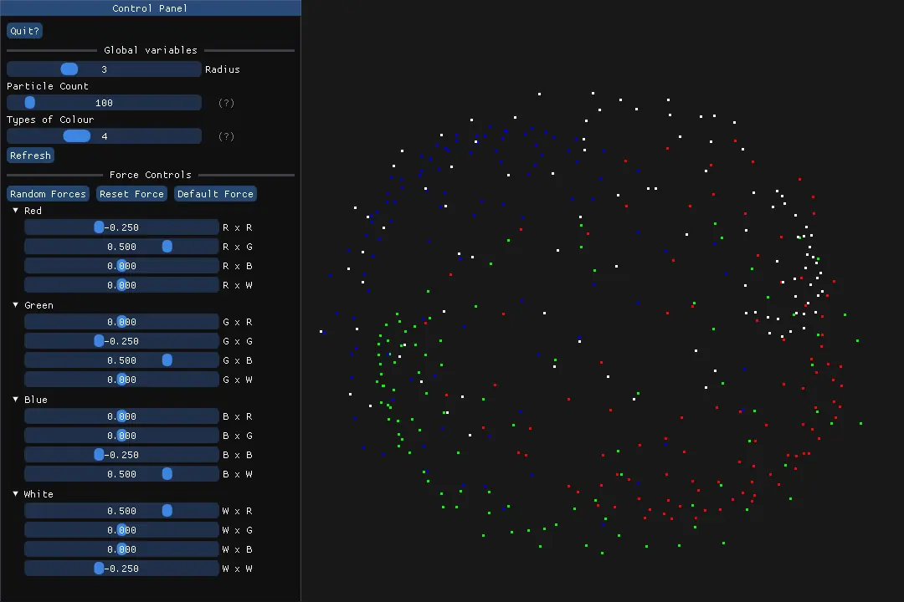

# Particle Life Simulation

An engaging implementation of the Particle Life simulation using C++, SDL2, and Dear ImGui. Watch as particles interact and form complex patterns based on simple rules!


## Screenshot



## Demo Video

https://github.com/user-attachments/assets/f3ac5313-b75a-42c1-b6f2-0283616d8000

## Prerequisites

Before you begin, a quick disclaimer: I was unable to run it in Windows platform. This codebase has no platform dependent code so it should've worked but due to my lack of knowledge on Windows I gave up trying to make it work after 6 hours of failure and I hadn't had the luxury of trying it out in a Mac. But it is confirmed and tested to work on many different linux distros and devices.

Anyway, ensure you have the following installed:

- C++ compiler (GCC, Clang, or MSVC)
- CMake (version 3.10 or higher)
- SDL2 library (Optional SDL2 is included, confirmed working on Linux only. Should work with other OS too)
- Git (For cloning the repository)

## Building the Project

Before building make sure you have the prerequisites downloaded.

#### Clone the repository:
If you have SDL2 installed in your system you can drop the `--recursive` flag.
```bash
git clone --recursive https://github.com/AnkushRoy-code/Particle.git
```

If you accidentally clone the repo without using `--recursive`, or you downloaded the repo using the GUI you can do this to fetch the depencency(SDL2) if you don't have them in your system:
```bash
git submodule update --init --recursive
```
#### and then
```bash
cd Particle
```

#### Create a build directory and navigate to it:
```bash
mkdir build && cd build
```

#### Generate the build files:
If you have installed SDL2 in your system you can add `-DParticleVendored=OFF` flag to the command to save a ton of your time. Else you can just do this:
```bash
cmake ..
```

#### Build the project:
```bash
make
```
And hope you don't get any errors.

## Running the Simulation
After building, you can run the simulation:

On macOS/Linux:
```bash
./particle
```
## Usage
For detailed usage instructions, refer to the [Usage Guide](./USAGE.md).
